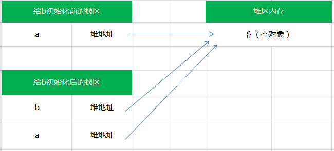

# 前端面试题

面试觉得自己实在太*垃圾*了，就来整理一下面试常问问题，做人还是要 **多总结**。
*****  

# 数据基本类型和引用类型
基本类型：undefined;null;string;number;boolean。
引用类型：基本类型之外的。
参见：[链接](https://www.jb51.net/article/65911.htm)




# BFC相关

### Box：css布局的基本单位

Box 是 CSS 布局的对象和基本单位， 直观点来说，就是一个页面是由很多个 Box 组成的。元素的类型和 display 属性，决定了这个 Box 的类型。不同类型的Box，会参与不同的 Formatting Context（一个决定如何渲染文档的容器），因此Box内的元素会以不同的方式渲染。让我们看看有哪些盒子：
- block-level box：display属性为block，list-item，table的元素，会生成block-level box。并且参与blocking formatting context；
- inline-level box：display属性为inline，inline-block,inline-table的元素，会生成inline-level box。并且参与inline formatting context。
- run-in box:css3新属性；run-in属性与inline-block区别：run-in表现为block元素还是inline元素与后面的元素完全相反，与前面元素display无关；而inline-block则与前一个元素相反。支持的浏览器并不多。

### Formatting Context

formatting context 是 w3c css2.1规范中的一个概念。它是页面中的一块渲染区域，并且有一套渲染规则，它决定了元素将如何定位，以及和其他元素的关系和相互作用。最常见的是Formatting context有Block formatting context（简称BFC）和inline formatting context（简称IFC）

### BFC的布局规则

- 内部的Box会在垂直方向，一个接一个地放置。
- Box垂直方向的距离由margin决定。属于同一个BFC的两个相邻Box的margin会发生重叠。
- 每个盒子（块盒与行盒）的margin box的左边，与包含块border box的左边相接触（对于从左往右的格式化，否则相反）。即使存在浮动也是如此。
- BFC的区域不会与float box重叠。
- BFC就是页面上的一个隔离的独立容器，容器里面的子元素不会影响到外面的元素，反之也是如此。
- 计算BFC的高度时，浮动元素也会参与。

### 如何创建BFC（下列条件满足一个即可生成BFC）

- float的值不是none；
- position的值不是static或者relative；
- display的值为inline-block、table-cell、flex、table-caption或者inline-flex；
- overflow的值不是visible。
- 
### BFC的作用
1、利用BFC避免margin重叠
``` bash
<style>
*{
        margin: 0;
        padding: 0;
    }
    p {
        color: #f55;
        background: yellow;
        width: 200px;
        line-height: 100px;
        text-align:center;
        margin: 30px;
    }
</style>
<body>
    <p>看看我的 margin是多少</p>
    <p>看看我的 margin是多少</p>
</body>
```

这两个p属于同一个BFC所以会发生margin重叠，所以想避免margin重叠可以设置它们分属于不同BFC。可以把第二个p用div包裹起来，激活这个div使之成为BFC。
```bash
<div style="overflow:hidden;">
	<p>看看我的 margin是多少</p>
</div>
```

2、自适应两栏布局
根据：
- 每个盒子（块盒与行盒）的margin box的左边，与包含块border box的左边相接触（对于从左往右的格式化，否则相反）。即使存在浮动也是如此。

``` bash
<style>
    *{
        margin: 0;
        padding: 0;
    }
    body {
        width: 100%;
        position: relative;
    }
 
    .left {
        width: 100px;
        height: 150px;
        float: left;
        background: rgb(139, 214, 78);
        text-align: center;
        line-height: 150px;
        font-size: 20px;
    }
 
    .right {
        height: 300px;
        background: rgb(170, 54, 236);
        text-align: center;
        line-height: 300px;
        font-size: 40px;
    }
</style>
<body>
    <div class="left">LEFT</div>
    <div class="right">RIGHT</div>
</body>
```

再根据：**BFC的区域不会与float box重叠**
我们让right单独成为一个BFC，给right加上`overflow:hidden;`；注意不要设置width；
这时right会自动适应宽度，形成两栏自适应布局。
如果是三栏自适应布局，则加一个div（float设置为right），注意要写在right前面，先于right渲染占位置。
*注：* 设置高度充满屏幕的方法：
- 设置html、body、div的height为100%；
- 设置div高度为100%，position为absolute；（float失效）
- 设置div高度100vh；	

3、清除浮动
如果父节点不设定高度，子节点设置浮动的时候，会发生高度塌陷，这时可利用BFC清除浮动。
原理：
计算BFC的高度时，浮动元素也参与计算。（注意是给父节点激活BFC）

